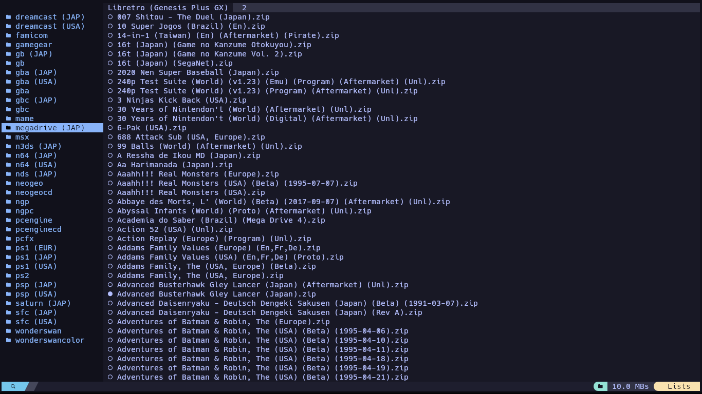

# Emux

A TUI application for launching URL-based lists and local files using custom commands



## Installation

```bash
git clone https://github.com/cris01000011/emux.git
cd emux
cargo build --release
```

## Configuration

### Setting the Base Directory

Create the configuration file at `~/.config/emux/emux.toml`:

```toml
[app]
base_dir = "/home/username/Emux"
```

If no configuration file exists, Emux will default to `~/Emux`

### Directory Structure

The base directory should contain the following structure:

```
Emux/
├── downloads/            # downloaded ITEMs are stored here
│   ├── list/
│   └── ...
├── lists/                # ITEM lists (JSON format)
│   ├── list.json
│   └── ...
├── local/                # local files
│   ├── path/
│   ├── file.[extension]
│   └── ...
└── system-lists/         # system-managed lists
│   └── favorites.json
└── lists_commands.json   # commands of lists
```

### List Format

Lists are stored as JSON files in the `lists/` directory. Each list should follow this format:

**n64.json**
```json
[
  {
    "item": "Legend of Zelda, The - Ocarina of Time (USA).zip",
    "url": "https://example.com/...",
  }
]
```

You can create new lists from within the app by pressing `n`, or manually add JSON files to the `lists/` directory.

> Pressing `n` in the app opens a popup where you must enter a list name and a URL.  
> The app will then scrape the provided webpage, automatically searching for `<a>` tags that link to files ending with:  
> `[".zip", ".chd", ".iso", ".7z", ".rar"]`

## List commands format

lists_commands.json should follow this format:
```json
[
  {
    "list": "n64",
    "commands": [
      {
        "name": "N64",
        "command": "@EMUX/scripts/n64.bash @ITEM"
      },
      {
        "name": "Mupen64Plus-Next",
        "command": "@EMUX/programs/retroarch.appimage --libretro mupen64plus_next -- @ITEM"
      }
    ]
  }
]
```

> `@EMUX` and `@ITEM` are placeholders that will be replaced at runtime by:  
> The Emux base directory and the route of the current item, respectively.

## Usage

### Navigation

- `Arrow Up/Down` - Move selection
- `Arrow Right` - Open list / Enter directory
- `Arrow Left` - Go back
- `Enter` - Launch Command / Start download
- `Tab` - Switch view / Next command
- `BackTab` - Prev view / Prev command

### Actions

- `/` - Search
- `f` - Toggle favorite
- `F` - Show favorites only
- `x` - Jump to random item
- `b` - Open browser search for current item
- `n` - Create new list
- `g` - Go to first item
- `G` - Go to last item
- `q` - Quit app
